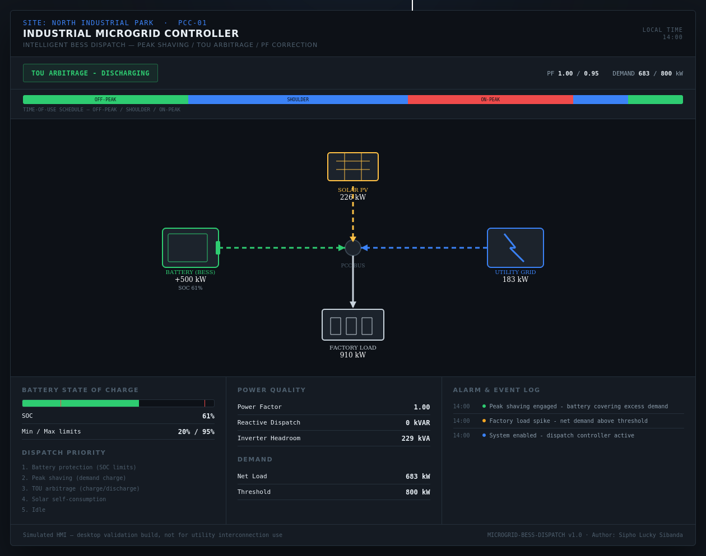
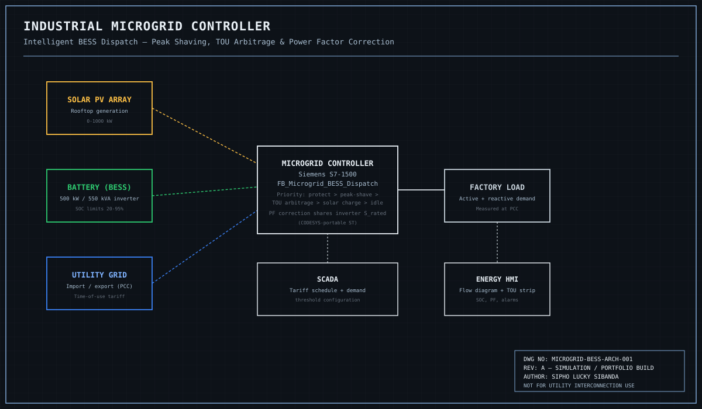

# ⚡🕹️ Industrial Microgrid Controller
### Intelligent Battery Energy Storage System (BESS) Dispatch

👁Live Project

### 🖥️🦠 Interactive HMI

╰┈➤[Launch the BESS HMI](https://hangmanlucky.github.io/microgrid-bess-dispatch/)


**Author:** Sipho Lucky Sibanda
**Series:** Automation Skills Portfolio — Electrical Engineering Technology
(a fifth discipline shift — the same PLC engineering discipline applied to behind-the-meter energy economics)

---

## ⚡ Context — Why This Matters

Industrial utility bills are often driven less by total energy consumed and more by
a single number: the highest 15/30-minute demand peak in the billing period. A
factory with rooftop solar and a battery energy storage system can use that battery
to shave those peaks, arbitrage cheap off-peak energy against expensive on-peak
energy, and correct its power factor — but only if the dispatch logic gets the
priority order right, because the battery can't do everything at once.

## 🔧 What This Project Does

`FB_Microgrid_BESS_Dispatch` is a PLC function block (IEC 61131-3 Structured Text) that:

- Dispatches battery active power in a **fixed, economically-grounded priority
  order**: battery protection limits first, then peak shaving (the single biggest
  bill lever), then time-of-use energy arbitrage, then solar self-consumption
- **Honestly reports** when the battery cannot fully cover a demand peak, rather
  than silently under-shaving and letting the bill exceed expectations unflagged
- Corrects **power factor** using the battery inverter's reactive power capability
  — genuinely respecting a real four-quadrant inverter's shared apparent-power
  ceiling with the active power already being dispatched
- Curtails solar only as a last resort, when the battery is full and the utility
  interconnection agreement doesn't permit export

## 🖥️ HMI — Energy Flow Dashboard

The `index.html` mockup shows power flowing between solar, battery, grid, and
factory load in real time, with a time-of-use schedule strip, live SOC and power
factor readouts, and an alarm log — matching exactly the "power flowing into a
factory" dashboard this project was scoped against.



## 🗺️ System Architecture



## ⚙️ Key Engineering Concepts

| Concept | How it's implemented |
|---|---|
| Peak shaving | Demand-charge-driven priority #1 — the highest-value use of stored energy |
| TOU arbitrage | Charge cheap, discharge expensive — but only after protection and peak shaving are satisfied |
| Power factor correction | Real PF = P/√(P²+Q²) math, with reactive dispatch clamped to actual inverter headroom |
| Shared inverter capability curve | Active and reactive power are not independent — √(P²+Q²) ≤ S_rated, enforced explicitly |
| Honest capacity reporting | A peak the battery can't fully cover is flagged, never silently under-shaved |

## 📁 Repository Structure

```
microgrid-bess-dispatch/
├── README.md
├── src/
│   └── Microgrid_BESS_Dispatch.st    # IEC 61131-3 Structured Text dispatch logic
├── docs/
│   ├── IO_List.md                    # Full I/O list, configuration parameters
│   └── Testing_Procedures.md         # FAT-style functional test cases
├── hmi/
│   └── index.html                    # Solar/battery/grid/factory energy flow HMI
└── images/
    ├── architecture_diagram.svg      # Control architecture diagram
    └── hmi-dashboard.png             # Rendered HMI screenshot
```

## 📄 Documentation

- [I/O List &amp; Configuration Parameters](IO_List.md)
- [Functional Test Procedures](Testing_Procedures.md)
- [Full Technical Manual (PDF)](Microgrid_Technical_Manual.pdf) — 25-page project ebook covering demand-charge industry context, architecture, hardware, the dispatch-priority/capability-curve control philosophy, full annotated code, HMI design, alarm philosophy, testing/commissioning, and a HAZOP-style hazard register

## ⚠️ Disclaimer

This is a **simulation and portfolio project**. It is not certified, has not been
tested against real hardware, and must not be used as a basis for an actual utility
interconnection or behind-the-meter energy storage system. A real installation
requires utility interconnection studies, protection coordination, and compliance
with local grid codes (e.g. IEEE 1547).

## 👤 Author

**Sipho Lucky Sibanda**
Automation & Controls Portfolio — Marine, Avionics, Architectural, Applied AI, Biotech, Electrical &amp; Industrial Systems

---
